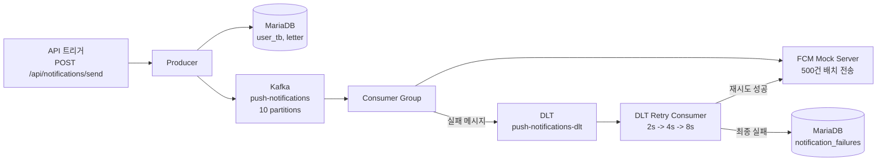

# ReTap 대규모 푸시 알림 파이프라인

기존 ReTap의 순차 FCM 발송 구조를 Kafka 기반 비동기 파이프라인으로 전환하고, 로컬 Docker 환경에서 100만 건 규모 푸시 알림 발송 성능을 측정한 프로젝트입니다.

## 목표

기존 구조는 알림 대상 사용자를 한 번에 `List`로 조회한 뒤 FCM을 순차 호출합니다. 이 방식은 대상자가 많아질수록 메모리 사용량과 전체 발송 시간이 크게 증가합니다.

이 프로젝트는 다음 구조로 개선합니다.

- DB 조회는 커서 기반 페이지네이션으로 1,000건씩 처리
- Producer는 Kafka에 userId를 key로 메시지 발행
- Consumer는 Kafka 메시지를 배치로 가져와 FCM Mock에 500건 단위 배치 전송
- 실패 메시지는 DLT로 보내고 재시도 후 최종 실패 테이블에 기록
- 로컬에서 10,000건 설정 실험과 1,000,000건 최종 측정 수행

## 아키텍처



측정 UI는 위 알림 처리 경로에 포함되는 런타임 컴포넌트가 아니라, 로컬 실험을 편하게 실행하기 위한 보조 도구입니다. Producer 트리거, FCM Mock 설정, Consumer 설정, CSV 조회를 브라우저에서 수행합니다.

## 모듈

| 경로 | 역할 |
|---|---|
| `docker-compose.yml` | MariaDB, Kafka, Kafka UI, FCM Mock, Producer, Consumer 실행 |
| `notification-producer/` | 알림 대상 조회, Kafka 메시지 발행, 트리거 API 제공 |
| `notification-consumer/` | Kafka 배치 소비, FCM Mock 배치 호출, DLT 재시도 처리 |
| `fcm-mock-server/` | FCM HTTP v1 단건 전송과 Mock 배치 전송, 메트릭 제공 |
| `seed/` | 100만 건 사용자/letter 시드 데이터 |
| `measurement/` | 측정 스크립트, 브라우저 UI, 결과 CSV |
| `e2e-tests/` | Producer-Kafka-Consumer-FCM 경로 통합 테스트 |

## 실행 방법

`.env.example`을 참고해 `.env`를 준비한 뒤 Docker Compose를 실행합니다.

```bash
docker compose up -d --build
```

주요 접속 주소:

| 서비스 | 주소 |
|---|---|
| FCM Mock | `http://localhost:8080/metrics` |
| Producer | `http://localhost:8081/status` |
| Consumer | `http://localhost:8082/status` |
| Kafka UI | `http://localhost:8083` |
| 측정 UI | `http://127.0.0.1:8090` |

측정 UI는 별도로 실행합니다.

```bash
python3 measurement/ui/server.py
```

## 측정 결과 요약

### 10,000건 기준 비교

환경:

- Kafka partitions: 10
- Consumer `max.poll.records`: 500
- FCM Mock delay: 50ms
- FCM Mock failure rate: 0%

| 시나리오 | 소요 시간 | 처리량 |
|---|---:|---:|
| 순차 FCM 호출 기준선 | 591.633초 | 16.902 msg/s |
| Kafka 파이프라인, FCM 단건 호출 | 589.000초 | 16.978 msg/s |
| Kafka 파이프라인, FCM 500건 배치 호출 | 1.672초 | 5,981.840 msg/s |

핵심 병목은 Kafka가 아니라 Consumer의 FCM 호출 방식이었습니다. FCM을 메시지마다 1회 호출하면 Kafka를 붙여도 전체 시간은 거의 줄지 않았고, 500건 단위 배치 호출로 바꾸면서 HTTP round-trip 수가 크게 줄었습니다.

### FCM Mock 지연 실험

| FCM Mock 지연 | 소요 시간 | 처리량 |
|---:|---:|---:|
| 20ms | 1.152초 | 8,682.134 msg/s |
| 50ms | 1.641초 | 6,095.309 msg/s |
| 100ms | 2.655초 | 3,767.124 msg/s |

FCM 배치 호출 1회당 지연이 커질수록 처리량이 낮아졌습니다. 현재 구조의 주요 비용이 Consumer-FCM 배치 호출 구간으로 이동했음을 보여줍니다.

### Consumer 배치 크기 실험

| `max.poll.records` | 소요 시간 | 처리량 |
|---:|---:|---:|
| 100 | 6.226초 | 1,606.088 msg/s |
| 200 | 3.675초 | 2,721.415 msg/s |
| 500 | 1.653초 | 6,048.868 msg/s |

`max.poll.records`는 Kafka Consumer가 한 번의 `poll()`에서 가져올 수 있는 최대 메시지 수입니다. 현재 Consumer는 poll로 받은 메시지 묶음을 FCM Mock 배치 요청으로 보내므로, 값이 작으면 FCM 배치 호출 횟수가 늘어납니다. FCM Mock의 배치 한도 500건과 맞춘 `500`이 가장 좋은 결과를 보였습니다.

### 100만 건 최종 측정

환경:

- Kafka partitions: 10
- Consumer `max.poll.records`: 500
- FCM Mock delay: 50ms
- FCM Mock failure rate: 0%

| 요청 | 발행 | FCM 성공 | FCM 실패 | Producer 발행 시간 | E2E 전체 시간 | 처리량 |
|---:|---:|---:|---:|---:|---:|---:|
| 1,000,000 | 1,000,000 | 1,000,000 | 0 | 4,477ms | 123.466초 | 8,099.365 msg/s |

100만 건 전체가 실패 없이 처리됐습니다. Producer는 100만 건을 약 4.5초에 발행했기 때문에 병목은 Producer/Kafka보다 Consumer-FCM 배치 처리 구간에 가깝습니다.

## FCM Mock 가정

FCM Mock의 배치 전송은 Firebase Admin SDK의 `sendEach` / `sendEachForMulticast`처럼 최대 500건 단위로 개별 성공/실패 응답을 받는 모델을 흉내냅니다.

다만 실제 FCM이 500건을 항상 동일한 시간에 처리한다고 주장하는 실험은 아닙니다. 이 프로젝트의 Mock delay는 “배치 HTTP 호출 1회의 비용”을 단순화한 값입니다. 따라서 결과는 실제 FCM 처리량 자체가 아니라, 단건 호출을 배치 호출로 줄였을 때 파이프라인 구조가 얼마나 개선되는지를 보여주는 로컬 시뮬레이션으로 해석해야 합니다.

## 파티션 수 실험 판단

현재 로컬 환경은 Kafka 파티션 10개와 Consumer 애플리케이션 1개로 구성되어 있습니다. 파티션 수를 늘린다고 무조건 빨라지는 것은 아닙니다. 파티션은 병렬 소비를 가능하게 하는 단위이고, 실제 처리량은 Consumer 인스턴스 수, listener concurrency, FCM 배치 지연과 함께 결정됩니다.

이번 측정에서는 Producer/Kafka보다 Consumer-FCM 배치 구간이 병목으로 확인됐기 때문에 파티션 수 실험은 필수로 보지 않았습니다. 다음 확장 실험을 한다면 파티션 수만 바꾸기보다 Consumer 인스턴스 수나 listener concurrency를 함께 늘려 수평 확장 효과를 보는 것이 더 의미 있습니다.

## 상세 측정 문서

상세 측정 방법과 CSV 결과는 [measurement/README.md](measurement/README.md)를 참고합니다.
